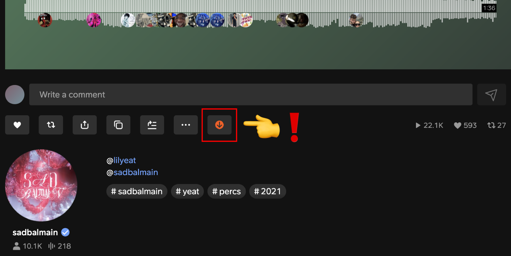
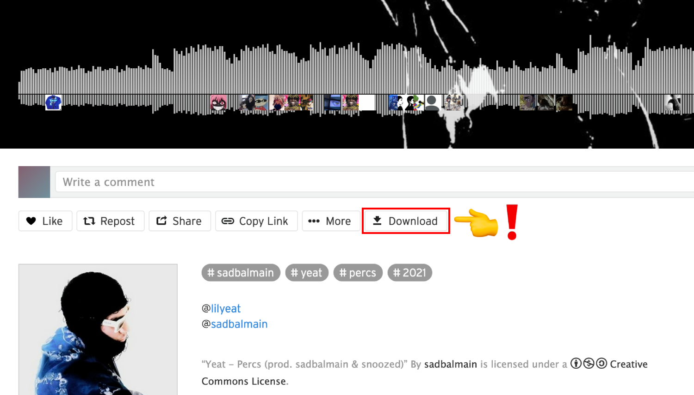
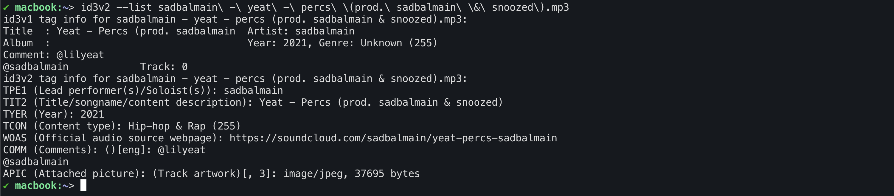
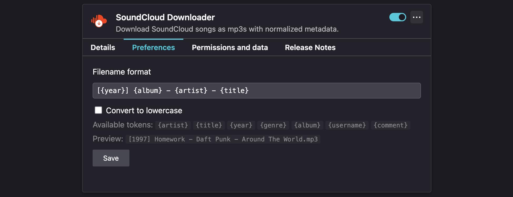

# SoundCloud Downloader


Firefox add-on that adds an instant download button under SoundCloud tracks.

## Get it now!

https://addons.mozilla.org/firefox/addon/scdl

## Features

- ✅ Download any SoundCloud track in mp3 format (128kbps, one at a time)
- ✅ Adds normalized metadata (artwork, artist, title, genre, year, description & source url)
- ✅ Customizable file name format (see Preferences tab in `about:addons`)
- ✅ Works with private tracks
- ✅ Supports both `progressive` and `hls` transcoding formats
- ✅ Lightweight (~20 Ko)
- ✅ No data sent to third party, everything is done client-side, in your browser
- ✅ No need to be premium or even logged in to download tracks!

If you encounter any issues, bugs, or have suggestions, please report them on the [GitHub Issues](https://github.com/nyo/scdl/issues) page!

## Preview







## Development

### Building

To build the add-on locally, run:

```bash
bash build.sh # creates a `scdl-{version}.zip` file
```

### External libraries

- [browser-id3-writer](https://github.com/egoroof/browser-id3-writer) for mp3s tagging
- [FileSaver.js](https://github.com/eligrey/FileSaver.js) for saving files client-side

_Happy digging!_
