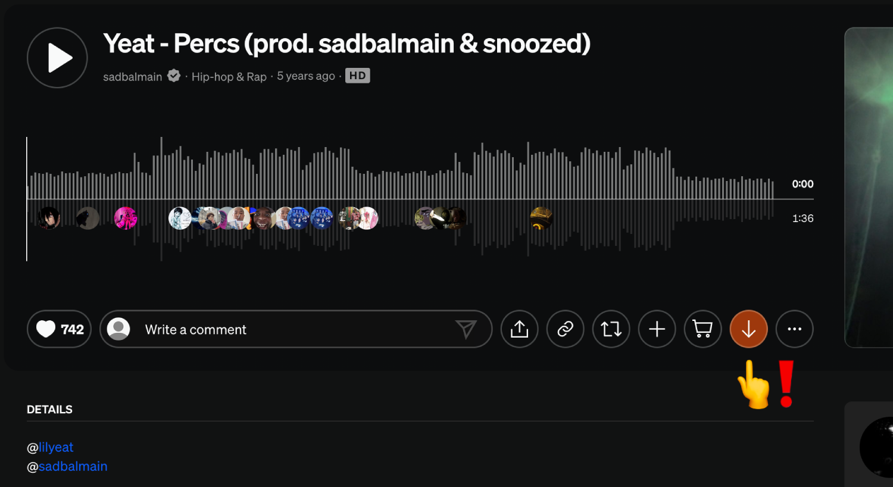
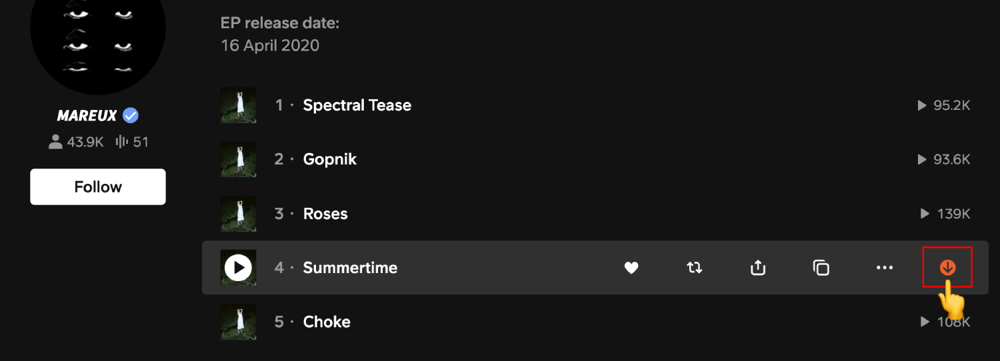
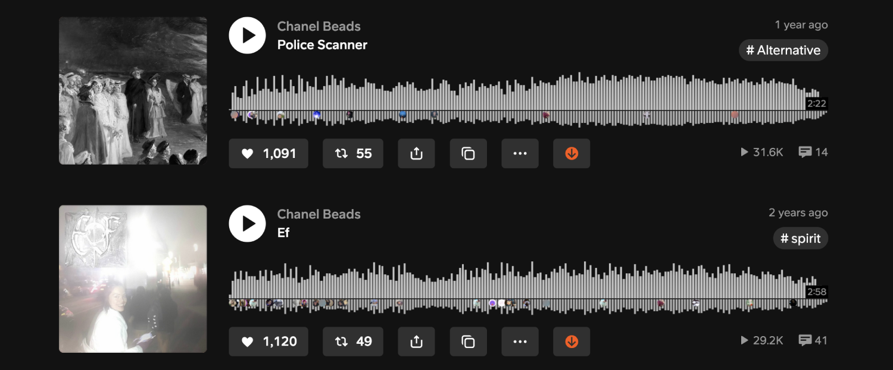
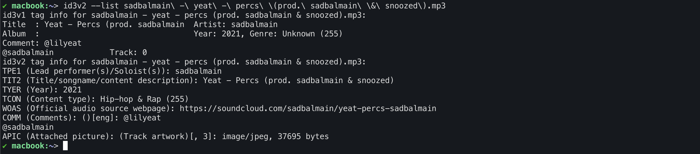
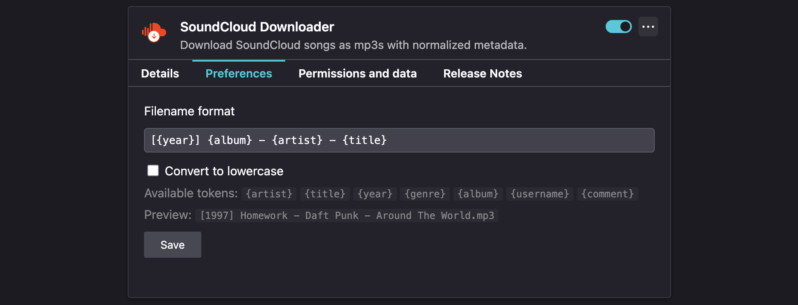

# SoundCloud Downloader


Firefox add-on that adds a download button under SoundCloud tracks.

No account, no sign-up, nothing sent anywhere.



<details>
<summary><b>Screenshots</b> (playlists, search results, tags, preferences)</summary>






</details>

## Get it now!

https://addons.mozilla.org/firefox/addon/scdl

## Features

- ✅ Download any SoundCloud track as a tagged mp3, artwork included
- ✅ Works without an account, a Go+ subscription, or even being logged in
- ✅ Works on private tracks shared through a secret link
- ✅ Works whatever language your SoundCloud is set to
- ✅ Customizable file name format (see Preferences tab in `about:addons`)
- ✅ Supports both `progressive` and `hls` transcoding formats

<details>
<summary><b>ID3v2.3 frames</b> (metadata/tags)</summary>

| Frame  | Content                          |
| ------ | -------------------------------- |
| `TIT2` | title                            |
| `TPE1` | artist                           |
| `TCOM` | composer                         |
| `TCON` | genre                            |
| `TYER` | year                             |
| `COMM` | the track description            |
| `WOAS` | the track's SoundCloud url       |
| `APIC` | artwork at 500x500, when the track has one |

</details>

## How it works

The file is built in your browser, straight from SoundCloud. Nothing goes through a server of mine, and there's no third-party site in the way.

The add-on only asks for access to `soundcloud.com` and for storage to keep your filename format.

No background process, ~29 KB.

## Limits

- mp3 at 128 kbps, one track at a time. No playlists or albums.
- SoundCloud has started locking some tracks behind DRM. Those can't be
  downloaded by this or any other extension. You get a clear message
  rather than a broken file.

If you encounter any issues, bugs, or have suggestions, please report them on the [GitHub Issues](https://github.com/nyo/scdl/issues) page!

## Development

### Building

To build the add-on locally, run:

```bash
bash build.sh # creates a `scdl-{version}.zip` file
```

### External libraries

- [browser-id3-writer](https://github.com/egoroof/browser-id3-writer) for mp3s tagging
- [FileSaver.js](https://github.com/eligrey/FileSaver.js) for saving files client-side
