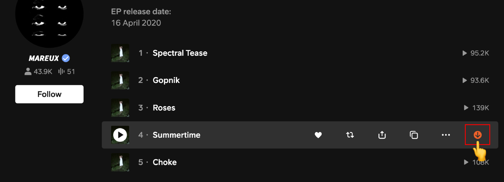
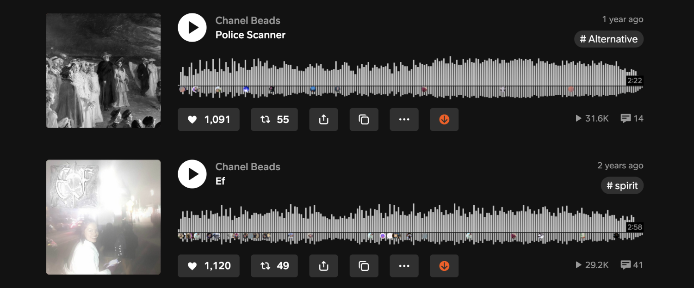

# SoundCloud Downloader

Firefox add-on that adds an instant download button under SoundCloud tracks.

## Get it now!
https://addons.mozilla.org/firefox/addon/scdl

## Features
- ✅ download any SoundCloud track in mp3 format (128kbps, one at a time)
- ✅ adds normalized metadata (artwork, artist, title, genre, year & source url)
- ✅ no data sent to third party, everything is done client-side, in your browser
- ✅ works with private tracks + supports both `progressive` and `hls` transcoding formats
- ✅ no need to be premium or even logged in to download tracks!

## Preview

## External libraries
- [browser-id3-writer](https://github.com/egoroof/browser-id3-writer) for mp3s tagging
- [FileSaver.js](https://github.com/eligrey/FileSaver.js) for saving files client-side

*Happy digging!*